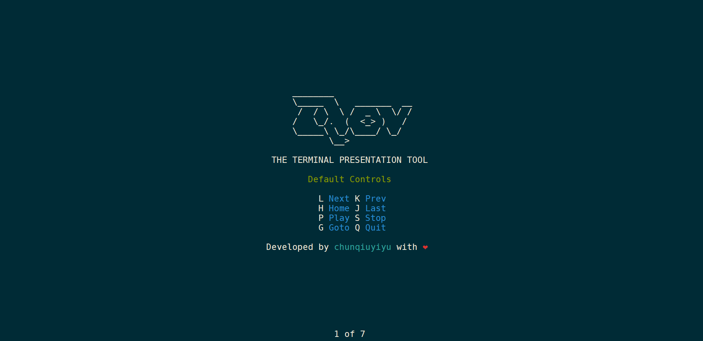

# Qov &middot; [](https://travis-ci.org/npm/npm) [](https://www.npmjs.com/package/qov) [](http://makeapullrequest.com) [](https://github.com/chunqiuyiyu/qov/blob/master/LICENSE)

> The terminal presentation tool.



## Features
* No third-party dependencies
* Tagged template literals
* Styled characters
* Fragments support
* Customized keyBinding
* Auto-sliding
* Easy to work with other libraries

## Getting started

```shell
npm install qov
```

Prepare texts for rendering slides.

```js
const Qov = require('qov')
const qov = new Qov()

qov.section`Section One`            
qov.section`Section Two`           

// Expression interpolation
qov.section`Section ${() => 'Three'}` 

// Render slides
qov.render()
```
Check [demo](./demo/index.js) for more details.

## APIs

### Constructor

```js
const qov = new Qov({ step?, keymap? })
```

step: milliseconds between auto-sliding, default is 2000.
keymap: customize keyBindings by yourself, defalut keymap is [here](./lib/keymap.js).

### Styles

```js
qov.styles.<Style>(str)
```

Style: style name, possiable value is blod, faint, italic, underline, slowBlink, rapidBlink, reverse or crossedOut.

str: characters which you want to render.

### Colors
Use `paint()` functon to render characters with color and backgroundColor.

```js
qov.colors.<Color>(str, isBg?)
qov.colors.paint(bgColor, fgColor, str)
```
Color, bgColor, fgColor: color name(black, red, green, yellow, blue, magenta, cyan, white).

isBg: render characters by backgroundColor or not, default is false.

## Much more
via [Tagged template literals](https://developer.mozilla.org/en-US/docs/Web/JavaScript/Reference/Template_literals#Tagged_templates), you can use other JS packages in Qov slides.**The only requirement is that package needs to return a string.**

## License

[MIT](./LICENSE)
